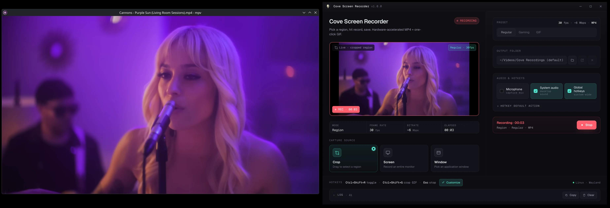

# Cove Screen Recorder

A small, fast, hardware-accelerated desktop screen recorder. Pick a region, screen, or window, hit record, get an MP4 — or a 10-second GIF in one click. Native Wayland and X11 on Linux.



## Features

- **Three capture modes** -- Crop (drag-to-select region), Screen (full monitor), Window (pick an app)
- **Three presets** -- Balanced (1080p, 30 fps, ~6 Mbps, MP4), Gaming (1080p, 60 fps, ~12 Mbps, MP4), GIF (10 s, 15 fps, palette-optimised)
- **Instant replay buffer** -- continuous rolling fMP4 segment buffer; save the last N seconds without a second capture pass
- **GPU-aware hardware encoding** -- detects vendor at startup and picks the matching encoder first (NVENC on NVIDIA, AMF on AMD, QSV on Intel). Falls back to `libx264` software so a recording is never lost
- **Recent recordings gallery** -- browse, play, and manage your saved recordings inline. Single-click selects (Ctrl/Shift for multi-select), double-click opens the in-app video player. Per-card delete, bulk delete/copy, and copy the video file to the OS clipboard (paste directly into Discord, Slack, or Outlook). Deleted recordings go to the OS trash / recycle bin, not permanent deletion, so a mis-click is recoverable
- **In-app video player** -- plays MP4, WebM, and GIF directly inside Cove. No external media player needed. Native controls with fullscreen, PiP, and keyboard shortcuts
- **Live preview** during recording -- see exactly the frames being saved
- **System audio + microphone** -- independent toggles. On Linux, system audio is captured via a parallel ffmpeg PulseAudio sidecar (clean stereo, full volume) and mixed onto the video at finalize
- **Unified toast notifications** -- on-screen toasts for recording start/save/replay/lifecycle events, auto-dismissing per type
- **Customisable global hotkeys** -- bind any combo for toggle / quick-GIF / replay save; defaults are `Ctrl+Shift+R`, `Ctrl+Shift+G`, and `F8`
- **Auto-update** -- electron-updater keeps the AppImage current. Download integrity is verified and update lifecycle is surfaced through toasts
- **Wayland-native** -- single xdg-desktop-portal prompt per recording, no double-dialog, no XWayland fallback
- **Cross-platform** -- AppImage, deb, and Windows (Portable .exe + NSIS Setup.exe) from a single repo. Every published binary ships with a `.sha256` sidecar

## Install

### Linux -- AppImage

```bash
chmod +x Cove-Screen-Recorder-3.3.0-x86_64.AppImage
./Cove-Screen-Recorder-3.3.0-x86_64.AppImage
```

### Linux -- Debian / Ubuntu

```bash
sudo dpkg -i Cove-Screen-Recorder-3.3.0-amd64.deb
sudo apt -f install   # if dependencies are missing
```

The deb declares `ffmpeg`, `pipewire`, and `xdg-desktop-portal` as dependencies, so `apt` pulls them in automatically.

### Windows

Download `Cove-Screen-Recorder-3.3.0-Setup.exe` for an NSIS installer or `Cove-Screen-Recorder-3.3.0-Portable.exe` to run without installing.

### Verify the download

Each artifact has a `<filename>.sha256` sidecar published next to it. Verify with:

```bash
sha256sum -c Cove-Screen-Recorder-3.3.0-x86_64.AppImage.sha256
# Cove-Screen-Recorder-3.3.0-x86_64.AppImage: OK
```

## Runtime requirements

| Component | Required for | How to install |
|---|---|---|
| `ffmpeg` on `PATH` | MP4 / GIF output | The deb pulls it in via `Depends`. AppImage users: `sudo apt install ffmpeg` / `sudo pacman -S ffmpeg` |
| `xdg-desktop-portal` + a backend | Wayland screen capture | `xdg-desktop-portal-kde` on KDE, `xdg-desktop-portal-gnome` on GNOME, `xdg-desktop-portal-wlr` on wlroots |
| `pipewire` + `pulseaudio` (or `pipewire-pulse`) | Linux system audio | Ships by default on every modern distro; Cove uses `pactl` + ffmpeg's `libpulse` input |

If `ffmpeg` is missing the recording falls back to a raw `.webm` and a warning is shown.

## Usage

1. Click **Crop**, **Screen**, or **Window** — that's it for normal use.
2. The toggle hotkey (default `Ctrl+Shift+R`) repeats whichever you last clicked. The GIF hotkey (default `Ctrl+Shift+G`) records a GIF of your selected source in one step.
3. `Esc` stops a recording. So does the OS "stop sharing" overlay on Wayland.

### Hotkeys

Click **Customize** in the bottom hint bar to rebind. Combos must include a modifier (Ctrl, Shift, Alt, or Super) — bare letters would steal global typing.

| Action | Default | Notes |
|---|---|---|
| Toggle default capture | `Ctrl+Shift+R` | Records using the action you last picked (Crop / Screen / Window) |
| Crop GIF | `Ctrl+Shift+G` | Records a GIF using the GIF preset |
| Save replay | `F8` | Saves the last N seconds from the replay buffer |
| Stop | `Esc` | Built-in, not customisable |

### Output

Files land in **~/Videos/Cove Recordings/** by default — change in the Output Folder field. Filename format: `Cove_YYYY-MM-DD_HHMMSS_NNN.{mp4,webm,gif}`. The `_NNN` is milliseconds so back-to-back recordings never overwrite. Tildes (`~/Videos/...`) are expanded automatically.

## Wayland notes

On Wayland the system portal owns source selection — clicking any of Crop / Screen / Window shows the same native dialog (KDE's "Share screen", GNOME's screen-share prompt, etc.) and lets you pick a monitor, window, or region from there. Cove passes a placeholder source ID through `setDisplayMediaRequestHandler` and lets PipeWire drive the picker directly — exactly one prompt per recording.

On X11, Crop mode shows a native drag-to-select overlay. On Wayland, the portal's source selection serves as the crop — recording starts immediately after the portal grants access.

### Linux system audio

Chromium's `getDisplayMedia` doesn't deliver clean system audio on Wayland. Cove side-channels system audio through a parallel ffmpeg process bound to PulseAudio's `<default-sink>.monitor`, then muxes the captured FLAC onto the video at finalize. Highlights:

- **Volume bumping** — PipeWire-Pulse can leave the monitor source's gain attenuated by default. Cove temporarily sets it to 100% during recording and restores the prior value on stop.
- **Lossless intermediate** — the sidecar writes FLAC, so the AAC encoding step at finalize is the only lossy generation in the pipeline.
- **Stereo + 48 kHz pinned** — `-ac 2 -ar 48000` is set explicitly to defeat ffmpeg builds that would otherwise default to mono.

If you have both microphone and system audio enabled, the two are mixed via ffmpeg's `amix` filter into a single stereo track.

## Build from source

Requires Node 20+ and `npm`.

```bash
git clone https://github.com/Sin213/cove-screen-recorder.git
cd cove-screen-recorder
npm install
npm run dev               # Vite + Electron, hot reload
npm run typecheck         # tsc on renderer + main

# Production builds — outputs go to release/ alongside .sha256 sidecars
npm run dist:linux        # AppImage
npm run dist:linux:full   # AppImage + deb
npm run dist:win          # Windows NSIS Setup + Portable
npm run dist:win:portable # Windows Portable only
npm run dist:sha          # regenerate SHA256 sidecars without rebuilding
```

## Stack

- Electron 32 · React 18 · TypeScript · Vite · Tailwind · Zustand
- Capture: `navigator.mediaDevices.getDisplayMedia` routed through `setDisplayMediaRequestHandler`. Wayland uses PipeWire screencast portal natively; X11 uses `desktopCapturer` source enumeration. Windows uses the native Screen Capture API
- Encode: `MediaRecorder` (VP9 / Opus 384k in WebM) -> system `ffmpeg` remux to MP4 / GIF. Encoder candidates are GPU-vendor-filtered and iterated on failure with `libx264` as the guaranteed software fallback

## Troubleshooting

**Wayland: I get two portal prompts.** That was the old bug; the current build issues exactly one. Make sure you're on a recent build and that `XDG_SESSION_TYPE=wayland` is set.

**Recording is mono / weird-sounding.** The audio is pinned to stereo + 48 kHz and goes through a lossless FLAC intermediate. If your PipeWire setup still produces unusual audio, file an issue with `ffprobe Cove_*.mp4 | grep -E 'channels|sample_rate'` and your `pactl info` server line.

**MP4 export is encoding on CPU even though I have a GPU.** Cove auto-picks the encoder matching your GPU vendor (`NVENC` for NVIDIA, `h264_amf` for AMD, `h264_qsv` for Intel). If you still see software fallback, file an issue with the full log so we can see which HW encoder failed first.

**MP4 export fails entirely.** Cove iterates through every viable encoder before giving up. If even libx264 fails, the temp `.webm` is **preserved** and its path is shown in the error so you can mux it manually with your own ffmpeg.

**Recording is black / blank.** On Wayland, the source dialog must be the system portal — install the right `xdg-desktop-portal-*` backend for your DE.

**The hotkey does nothing.** Some compositors grab specific combos system-wide. Try a different combo via **Customize** (e.g. `Alt+Shift+R`).

## Acknowledgements

Thanks to [Kraibse](https://github.com/Kraibse) for testing, reporting crop overlay rendering issues on Wayland, and suggesting the double-prompt UX fix.

Thanks to Qb for the suggestions behind the gallery and in-app player work, and to Whooshy for testing.

## License

MIT
